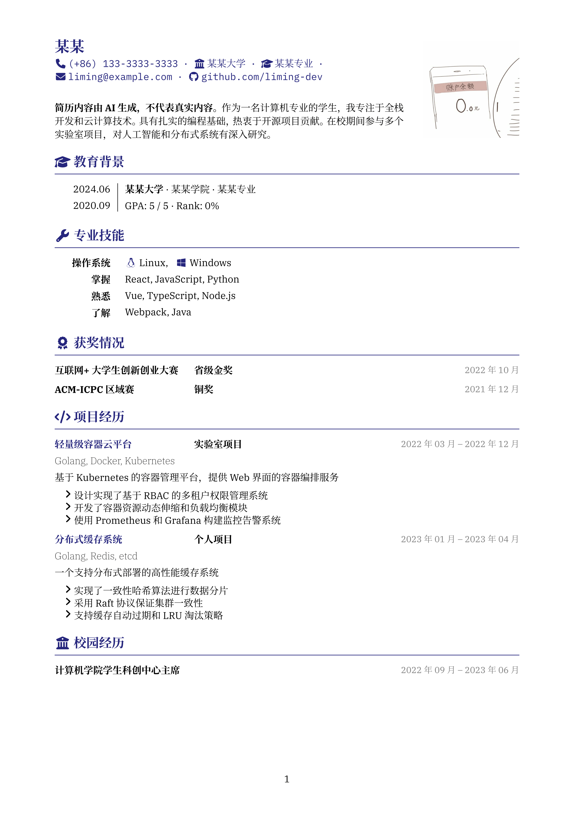
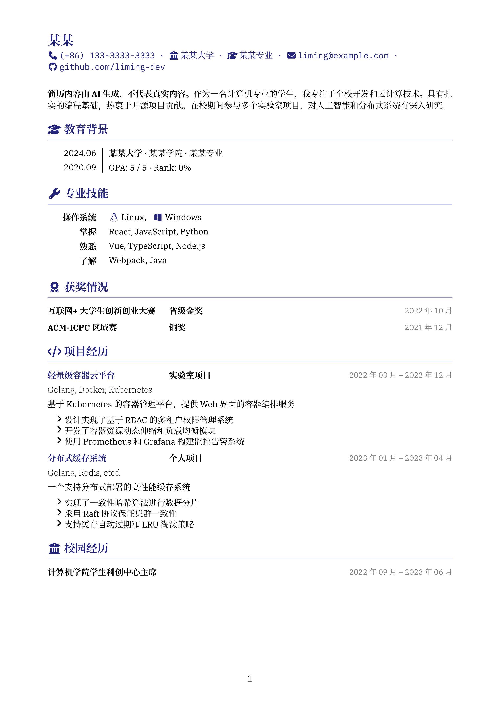

# Chinese Resume in Typst

使用 Typst 编写的中文简历.

样式上, 参考了 [liweitianux/resume](https://github.com/liweitianux/resume) 与 [uniquecv](https://github.com/dyinnz/uniquecv). 同时也参考了一部分 [uniquecv-typst](https://github.com/gaoachao/uniquecv-typst) 的写法.

语法上, 基于以下 Typst 的设计原则编写 (简洁一致与组合原则):

> - **Simplicity through Consistency:** If you know how to do one thing in Typst, you should be able to transfer that knowledge to other things. If there are multiple ways to do the same thing, one of them should be at a different level of abstraction than the other. E.g. it's okay that `= Introduction` and `#heading[Introduction]` do the same thing because the former is just syntax sugar for the latter.
> - **Power through Composability:** There are two ways to make something flexible: Have a knob for everything or have a few knobs that you can combine in many ways. Typst is designed with the second way in mind. We provide systems that you can compose in ways we've never even thought of. TeX is also in the second category, but it's a bit low-level and therefore people use LaTeX instead. But there, we don't really have that much composability. Instead, there's a package for everything (\usepackage{knob}).


## 使用

### 在线编辑

可以使用 Typst 的 Web App,

模板链接: https://typst.app/project/rw1SLr0IIZZnCrkrsypRQF


### 本地编辑（推荐）

- 安装 VS Code，以及 [Tinymist Typst](https://marketplace.visualstudio.com/items?itemName=myriad-dreamin.tinymist) 插件。
- 打开 `resume.typ` 文件，按下 `Ctrl + K V` 快捷键后即可显示与编辑。
- 点击源代码顶部的 `Export PDF` 即可导出 PDF 文件。


## 效果

包含照片:



不包含照片:




## 示例

你可以使用 **简洁** 与 **组合式** 的语法出美观的效果.

```typst
// 设置简历选项与头部
#show: resume.with(
  // 字体和基准大小
  size: 10pt,
  // 标题颜色
  theme-color: theme-color,
  // 控制纸张的边距
  margin: (
    top: 1.5cm,
    bottom: 2cm,
    left: 2cm,
    right: 2cm,
  ),

  // 如果需要姓名及联系信息居中，请删除下面关于头像的三行参数，并取消headerCenter的注释
  //headerCenter : true,

  // 如果不需要头像，则将下面三行的参数注释或删除
  photograph: "profile.jpg",
  photograph-width: 10em,
  gutter-width: 2em,
)[
  = 某某

  #info(
    color: theme-color,
    (
      icon: fa-phone,
      content: "(+86) 133-3333-3333",
    ),
    (
      icon: fa-building-columns,
      content: "某某大学",
    ),
    (
      icon: fa-graduation-cap,
      content: "某某专业",
    ),
    (
      icon: fa-envelope,
      content: "liming@example.com",
      link: "mailto:liming@example.com",
    ),
    (
      icon: fa-github,
      content: "github.com/liming-dev",
      link: "https://github.com/liming-dev",
    ),
  )
][
  #h(2em)

  *简历内容由 AI 生成，不代表真实内容。*作为一名计算机专业的学生，我专注于全栈开发和云计算技术。具有扎实的编程基础，热衷于开源项目贡献。在校期间参与多个实验室项目，对人工智能和分布式系统有深入研究。
]
```

以及每一个块

```typst
== #fa-graduation-cap 教育背景

#sidebar(with-line: true, side-width: 12%)[
  2024.06

  2020.09
][
  *某某大学* · 某某学院 · 某某专业

  GPA: 5 / 5 · Rank: 0%
]
```

```typst
== #fa-code 项目经历

#item(
  link(
    "https://github.com/liming-dev/cloud-platform",
    [ *轻量级容器云平台* ],
  ),
  [ *实验室项目* ],
  date[ 2022 年 03 月 – 2022 年 12 月 ],
)

#tech[ Golang, Docker, Kubernetes ]

基于 Kubernetes 的容器管理平台，提供Web界面的容器编排服务

- 设计实现了基于 RBAC 的多租户权限管理系统
- 开发了容器资源动态伸缩和负载均衡模块
- 使用 Prometheus 和 Grafana 构建监控告警系统
```
